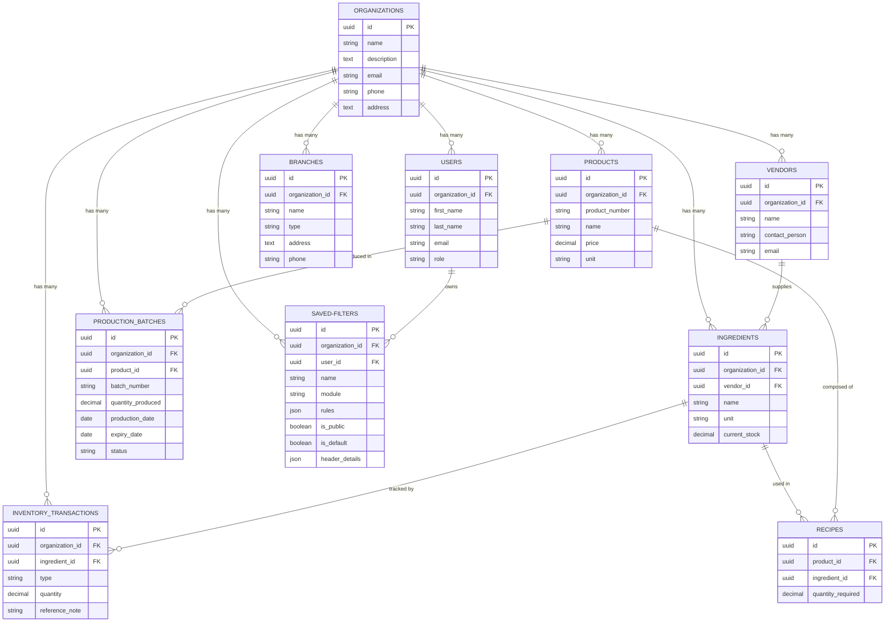

# Bakery WMS - Application Overview

## 1. What is this Application?

Bakery WMS (Warehouse Management System) is a backend API application built for bakery businesses to manage their day-to-day operations. It helps bakery owners and staff to:

- Manage their organization and team members
- Track raw material (ingredient) inventory
- Manage vendor/supplier relationships
- Define bakery products and their recipes
- Record stock movements (purchases, production usage, wastage)
- Get low-stock alerts for ingredients

---

## 2. Tech Stack

| Layer          | Technology                  |
|----------------|-----------------------------|
| Framework      | Laravel (PHP 8.3+)          |
| Database       | MySQL                       |
| Authentication | Laravel Sanctum (Token-based) |
| API Format     | RESTful JSON API (v1)       |
| Primary Keys   | UUID                        |
| Testing        | PHPUnit (SQLite in-memory)  |

---

## 3. Architecture

The application follows a **modular architecture** where each feature is organized as an independent module under `app/Modules/Api/V1/`. Each module contains its own:

```
app/Modules/Api/V1/{ModuleName}/
├── Controllers/    # Handles HTTP requests and responses
├── Models/         # Eloquent database models
├── Requests/       # Form request validation rules
└── Resources/      # API response transformers (JSON formatting)
```

All API routes are prefixed with `/api/v1/` and defined in `routes/api.php`.

---

## 4. Modules

### 4.1 Organization Module
**Purpose:** Represents the bakery business entity. Every other record in the system belongs to an organization.

- Create, view, update, delete organizations
- Search organizations by keyword
- First user created with an organization is assigned the `owner` role

### 4.2 User Module (Settings)
**Purpose:** Manages team members within an organization. Supports role-based access.

- Create, view, update, delete users
- List users (filter by organization)
- Roles: `owner`, `admin`, `staff`
- Authentication via Laravel Sanctum (login/logout with bearer tokens)

### 4.3 Vendor Module
**Purpose:** Manages raw material suppliers. Vendors supply ingredients to the bakery.

- Create, view, update, delete vendors
- List vendors (filter by organization)
- Each vendor is linked to an organization

### 4.4 Ingredient Module
**Purpose:** Manages raw materials used in bakery production (e.g., Flour, Sugar, Butter, Yeast).

- Create, view, update, delete ingredients
- List ingredients (filter by organization)
- Each ingredient tracks its `current_stock` and `minimum_stock_level`
- Low stock alert endpoint: returns ingredients where `current_stock < minimum_stock_level`
- Optionally linked to a vendor

### 4.5 Inventory Transaction Module
**Purpose:** Records every stock movement for ingredients. Acts as a ledger/audit log.

- List transactions (filter by ingredient)
- Create transaction (automatically updates ingredient stock)
- Transaction types:
  - `in` — Stock received (e.g., purchase from vendor) → increases stock
  - `out` — Stock removed manually → decreases stock
  - `waste` — Stock lost due to spoilage/damage → decreases stock
  - `production` — Stock consumed during baking → decreases stock

### 4.6 Product Module
**Purpose:** Manages the final bakery products that are sold to customers (e.g., Sweet Bread, Halwa, Cake).

- Create, view, update, delete products
- List products (filter by organization)
- Auto-generated `product_number` in sequence: `PROD1`, `PROD2`, `PROD3`, etc.
- Supports unit-based pricing via `unit` field:
  - `pcs` — Piece-based items (e.g., 1 Bread = ₹50)
  - `kg` — Weight-based items (e.g., 1kg Halwa = ₹400, 500g = ₹200)
  - Other allowed units: `g`, `l`, `ml`, `pkt`

### 4.7 Recipe Module
**Purpose:** Defines the ingredient composition of a product. Specifies how much of each ingredient is required to produce one unit of a product.

- List recipe ingredients for a product
- Add an ingredient to a product's recipe
- Remove an ingredient from a product's recipe
- Each recipe entry records the `quantity_required` of an ingredient

### 4.8 Saved Filters & Headers Module
**Purpose:** Allows users to create, delete, and apply custom search filters (with conditional rules like field, operator, and value) dynamically. It also manages custom table column visibility (headers configuration) per module.

- Create custom saved filters with logical conditions (`AND`/`OR`) and safety-whitelisted operator rules
- List saved filters (with automatically seeded system-wide default "All" filters)
- Delete user-defined filters (system default filters cannot be deleted)
- Dynamically filter resources on-the-fly for any list endpoint (e.g. `GET /api/v1/products?savedFilterId=...` or using raw inline `rules`)
- Match, query, and return module field configuration configurations and header mappings via `/api/v1/headers` and `/api/v1/headers/{filterId}`

### 4.9 Branch Module
**Purpose:** Manages the different physical locations (branches) of the bakery organization.

- Create, view, update, delete branches
- List branches (filter by organization)
- Defines branch types: `warehouse` and `retail`

### 4.10 Production Batch Module
**Purpose:** Logs the production of finished bakery products. Acts as the bridge between raw ingredients and finished goods inventory.

- Create, view, update, delete production batches
- Automatically deducts required ingredient quantities from inventory based on product recipes
- Automatically logs `out` inventory transactions for consumed ingredients
- Automatically adds the produced quantity to the product's `current_stock`
- Automatically calculates the batch expiry date based on the product's shelf life

### 4.11 Branch Transfer & Stock Module
**Purpose:** Manages the transfer of finished goods from the central warehouse to individual retail branches and tracks their local inventory.

- Log dispatches from warehouse to branch
- Automatically deducts from warehouse `Product` stock
- Automatically increments local `BranchStock`
- Lists branch-specific current stock

### 4.12 Reports Module
**Purpose:** Generates analytical and operational reports for the bakery.

- **Expiring Batches Report:** Tracks `ProductionBatch` expiry timestamps and groups them into `expired`, `expiringSoon` (within 24 hours), and `healthy` categories to facilitate FIFO (First-In, First-Out) shelf management.
- **Dashboard Summary:** Generates daily KPIs (Sales, Waste, Production), a 7-day sales trend graph data array, and top 5 best-selling products list for executive dashboards.

### 4.13 Branch Sales Module
**Purpose:** Allows retail branches to log their end-of-day sales and returns, updating the financial and stock records automatically.

- Submit End-of-Day report with quantities sold and quantities returned (wasted/unsold) per product.
- Automatically calculates `subtotal_revenue` and `subtotal_waste` based on current product prices.
- Automatically deducts the sum of sold and returned items from the physical `BranchStock` levels.

---

## 5. Database Tables & Schema

### 5.1 `organizations`
| Column      | Type       | Constraints          |
|-------------|------------|----------------------|
| id          | UUID       | Primary Key          |
| name        | string     | Required             |
| description | text       | Nullable             |
| email       | string     | Nullable             |
| phone       | string     | Nullable             |
| address     | text       | Nullable             |
| created_at  | timestamp  |                      |
| updated_at  | timestamp  |                      |

---

### 5.2 `users`
| Column            | Type       | Constraints                       |
|-------------------|------------|-----------------------------------|
| id                | UUID       | Primary Key                       |
| organization_id   | UUID       | Foreign Key → organizations (cascade delete) |
| branch_id         | UUID       | Nullable                          |
| first_name        | string     | Required                          |
| last_name         | string     | Required                          |
| email             | string     | Unique, Required                  |
| phone             | string     | Nullable                          |
| role              | string     | Required (owner / admin / staff)  |
| email_verified_at | timestamp  | Nullable                          |
| password          | string     | Required (hashed)                 |
| remember_token    | string     | Nullable                          |
| created_at        | timestamp  |                                   |
| updated_at        | timestamp  |                                   |

---

### 5.3 `vendors`
| Column         | Type       | Constraints                       |
|----------------|------------|-----------------------------------|
| id             | UUID       | Primary Key                       |
| organization_id| UUID       | Foreign Key → organizations (cascade delete) |
| name           | string     | Required                          |
| contact_person | string     | Nullable                          |
| phone          | string     | Nullable                          |
| email          | string     | Nullable                          |
| address        | text       | Nullable                          |
| created_at     | timestamp  |                                   |
| updated_at     | timestamp  |                                   |

---

### 5.4 `ingredients`
| Column              | Type          | Constraints                       |
|---------------------|---------------|-----------------------------------|
| id                  | UUID          | Primary Key                       |
| organization_id     | UUID          | Foreign Key → organizations (cascade delete) |
| vendor_id           | UUID          | Nullable, Foreign Key → vendors   |
| name                | string        | Required                          |
| unit                | string        | Required (e.g., g, kg, l, ml)     |
| minimum_stock_level | decimal(10,2) | Default: 0                        |
| current_stock       | decimal(10,2) | Default: 0                        |
| created_at          | timestamp     |                                   |
| updated_at          | timestamp     |                                   |

---

### 5.5 `inventory_transactions`
| Column          | Type          | Constraints                       |
|-----------------|---------------|-----------------------------------|
| id              | UUID          | Primary Key                       |
| organization_id | UUID          | Foreign Key → organizations (cascade delete) |
| ingredient_id   | UUID          | Foreign Key → ingredients (cascade delete) |
| type            | string        | Required (in / out / waste / production) |
| quantity        | decimal(10,2) | Required                          |
| reference_note  | string        | Nullable                          |
| created_at      | timestamp     |                                   |
| updated_at      | timestamp     |                                   |

---

### 5.6 `products`
| Column          | Type          | Constraints                       |
|-----------------|---------------|-----------------------------------|
| id              | UUID          | Primary Key                       |
| organization_id | UUID          | Foreign Key → organizations (cascade delete) |
| product_number  | string        | Unique, Auto-generated (PROD1, PROD2...) |
| name            | string        | Required                          |
| description     | text          | Nullable                          |
| price           | decimal(10,2) | Nullable                          |
| unit            | string        | Default: pcs (pcs/kg/g/l/ml/pkt)  |
| shelf_life_days | integer       | Nullable                          |
| current_stock   | decimal(10,2) | Default: 0                        |
| created_at      | timestamp     |                                   |
| updated_at      | timestamp     |                                   |

---

### 5.7 `recipes`
| Column            | Type          | Constraints                                  |
|-------------------|---------------|----------------------------------------------|
| id                | UUID          | Primary Key                                  |
| product_id        | UUID          | Foreign Key → products (cascade delete)      |
| ingredient_id     | UUID          | Foreign Key → ingredients (cascade delete)   |
| quantity_required | decimal(10,2) | Required                                     |
| created_at        | timestamp     |                                              |
| updated_at        | timestamp     |                                              |
| —                 | —             | Unique constraint on (product_id, ingredient_id) |

---

### 5.8 `saved-filters`
| Column          | Type      | Constraints                                  |
|-----------------|-----------|----------------------------------------------|
| id              | UUID      | Primary Key                                  |
| organization_id | UUID      | Nullable, Foreign Key → organizations (cascade delete) |
| user_id         | UUID      | Nullable, Foreign Key → users (cascade delete)   |
| name            | string    | Required                                     |
| module          | string    | Required (User / Vendor / Ingredient / InventoryTransaction / Product) |
| rules           | JSON      | Required                                     |
| is_public       | boolean   | Default: false                               |
| is_default      | boolean   | Default: false                               |
| header_details  | JSON      | Nullable                                     |
| created_at      | timestamp |                                              |
| updated_at      | timestamp |                                              |

---

### 5.9 `branches`
| Column          | Type      | Constraints                                  |
|-----------------|-----------|----------------------------------------------|
| id              | UUID      | Primary Key                                  |
| organization_id | UUID      | Foreign Key → organizations (cascade delete) |
| name            | string    | Required                                     |
| type            | string    | Required (warehouse / retail)                |
| address         | text      | Nullable                                     |
| phone           | string    | Nullable                                     |
| created_at      | timestamp |                                              |
| updated_at      | timestamp |                                              |

---

### 5.10 `production_batches`
| Column            | Type          | Constraints                                  |
|-------------------|---------------|----------------------------------------------|
| id                | UUID          | Primary Key                                  |
| organization_id   | UUID          | Foreign Key → organizations (cascade delete) |
| product_id        | UUID          | Foreign Key → products (cascade delete)      |
| batch_number      | string        | Unique, Auto-generated (e.g., BATCH-2026...) |
| quantity_produced | decimal(10,2) | Required                                     |
| production_date   | date          | Required                                     |
| expiry_date       | date          | Nullable                                     |
| status            | string        | Default: 'completed'                         |
| notes             | text          | Nullable                                     |
| created_by        | UUID          | Nullable, Foreign Key → users                |
| created_at        | timestamp     |                                              |
| updated_at        | timestamp     |                                              |

---

## 6. Table Relationships (ER Diagram)



---

## 7. Business Workflow

Below is the typical workflow of how a bakery uses this system:

```
Step 1: Create Organization
         ↓
Step 2: Add Users (Owner, Admin, Staff)
         ↓
Step 3: Add Vendors (Flour Supplier, Sugar Supplier, etc.)
         ↓
Step 4: Add Ingredients (Flour, Sugar, Butter, Yeast, etc.)
         ↓
Step 5: Record Inventory Transactions
         • Purchase ingredients from vendors (type: "in")
         • Track wastage (type: "waste")
         ↓
Step 6: Create Products (Sweet Bread, Halwa, Cake, etc.)
         • Set unit (pcs for items, kg for loose items)
         • Set price per unit
         ↓
Step 7: Define Recipes for each Product
         • Sweet Bread needs: 500g Flour + 100g Sugar + 50g Butter
         • Halwa needs: 300g Sugar + 200g Ghee + 100g Flour
         ↓
Step 8: Monitor Stock Levels
         • Check low-stock ingredients
         • Reorder from vendors when stock is low
```

---

## 8. Authentication & Security

- **Token-Based Auth:** Uses Laravel Sanctum. Every API request (except organization creation and login) requires a `Bearer` token in the `Authorization` header.
- **Middleware:**
  - `auth:sanctum` — Validates the bearer token
  - `check.org` — Ensures the user has access to the organization context
- **Password Hashing:** All passwords are hashed using bcrypt before storing.
- **Cascade Deletes:** Deleting an organization removes all its associated users, vendors, ingredients, products, recipes, and transactions.

---

## 9. API Response Format

All API responses follow a consistent envelope structure:

**Single Resource:**
```json
{
    "data": {
        "values": {
            "id": "uuid",
            "field1": "value1",
            "field2": "value2"
        }
    }
}
```

**Collection (List):**
```json
{
    "data": [
        {
            "values": {
                "id": "uuid",
                "field1": "value1"
            }
        }
    ]
}
```

**Delete Response:**
```json
{
    "message": "Resource successfully deleted."
}
```

---

## 10. File Structure

```
backend/
├── app/
│   ├── Http/
│   │   └── Controllers/         # Base controller
│   └── Modules/
│       └── Api/V1/
│           ├── Organization/    # Organization module
│           ├── User/            # User & Auth module
│           ├── Vendor/          # Vendor module
│           ├── Ingredient/      # Ingredient module
│           ├── InventoryTransaction/  # Stock transaction module
│           ├── Product/         # Product module
│           ├── Recipe/          # Recipe module
│           └── SavedFilter/     # Saved filters & dynamic headers module
├── database/
│   └── migrations/              # All database migration files
├── routes/
│   └── api.php                  # All API route definitions
├── tests/
│   └── Feature/                 # Feature/integration tests
├── api_docs.md                  # API endpoint documentation (Postman bodies)
├── app_overview.md              # This file
├── composer.json
└── phpunit.xml
```

---

## 11. Recent Updates & Refactoring

The following recent changes were implemented across the application:

1. **Standardized Update Operations**: All module update endpoints were changed from `PUT /{id}` to `POST /{id}` for consistency across the API.
   - *Files modified*: `routes/api.php`, `api_docs.md`, and multiple tests (`AuthTest.php`, `Phase2Test.php`, `FilterTest.php`).

2. **PascalCase Endpoint Naming**: All module endpoint prefixes were standardized to singular PascalCase (e.g., `/api/v1/Ingredient` instead of `/api/v1/ingredients`).
   - *Files modified*: `routes/api.php`, `api_docs.md`.

3. **Dynamic Headers Retrieval**: Implemented the `{module}/headers` and `{module}/headers/{filterId}` dynamic routes to fetch frontend table column definitions based on saved filters or the module default.
   - *Files modified*: `routes/api.php`, `api_docs.md`, `HeaderController.php`.

4. **Saved Filters Module Completion**: Finished the implementation of the `SavedFilter` system including database migrations, rules definition parsing, and default filter seeding.
   - *Files worked on*: `SavedFilterController.php`, `FilterTest.php`, `ResultTrait.php` (restored paginated response structure format `list`, `meta`, `links`).

5. **Postman API Documentation**: Expanded `api_docs.md` with comprehensive request body examples for `POST` and creation events, specifically including real-world examples for creating Ingredients (Flour, Butter, Yeast, Chocolate Chips) and integrating them into Recipes.

